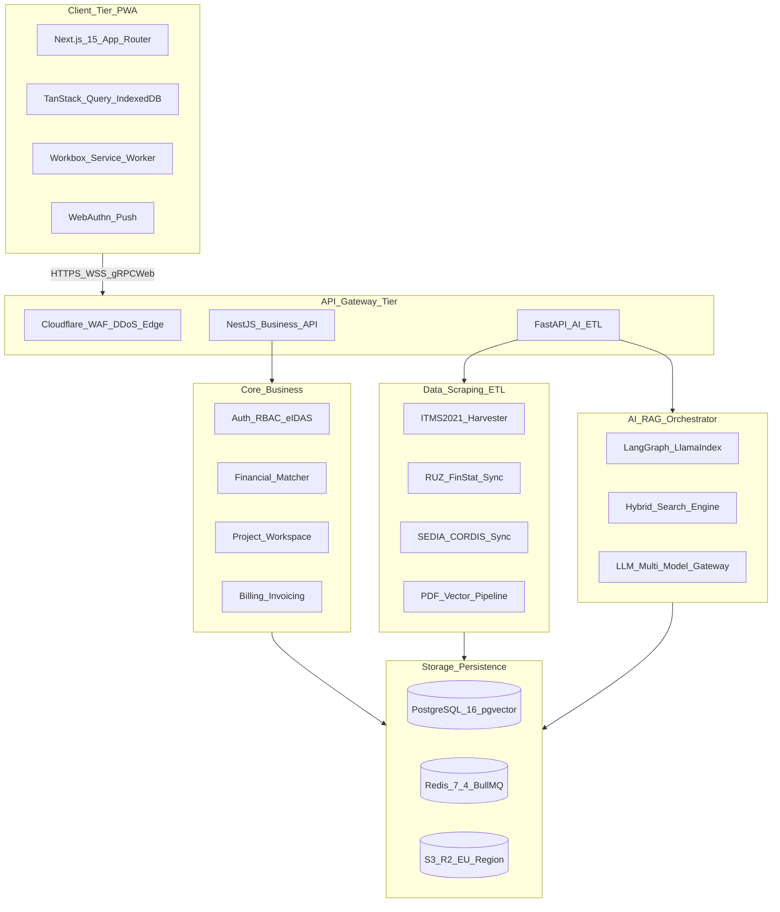
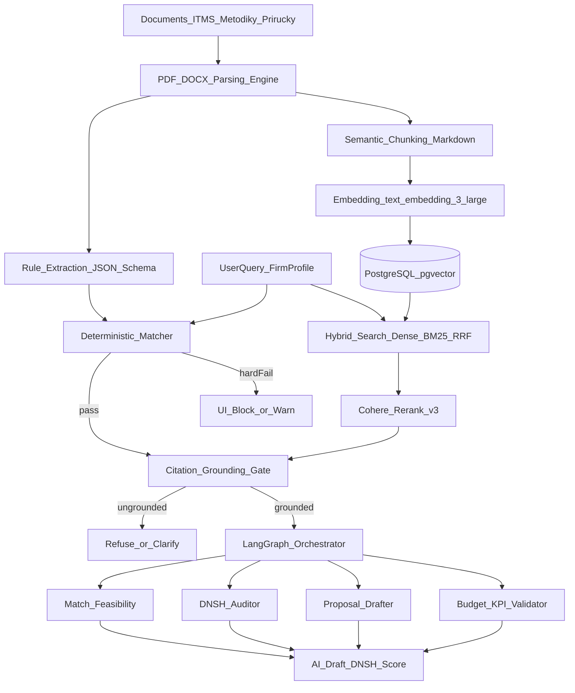
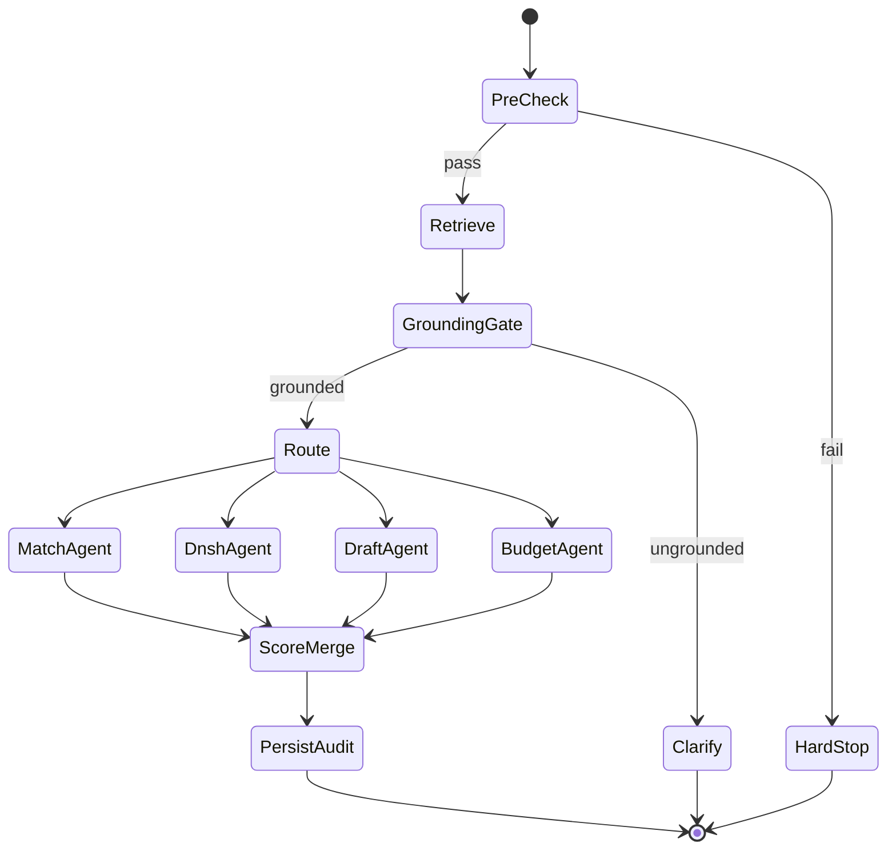
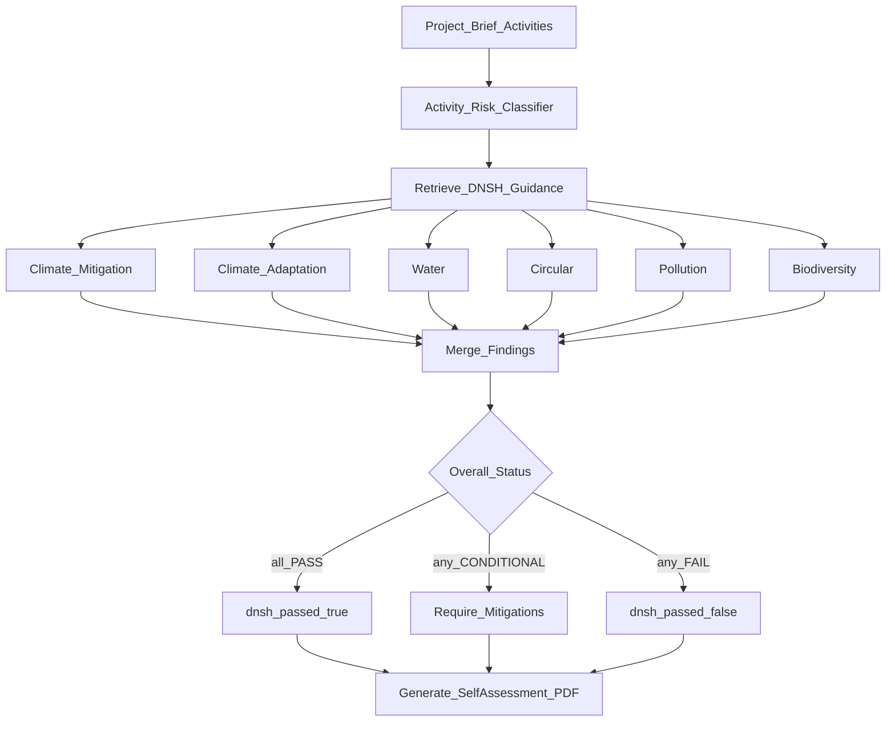

# Technický a Produktový Blueprint: Národná B2B PWA Platforma pre Inteligentný Manažment a Tvorbu EU Dotácií pre Slovenské MSP

| Meta | Hodnota |
|------|---------|
| **Pracovný názov** | GrantFlow Slovensko (GrantFlow.sk) |
| **Verzia** | **v2 — AI/DNSH Deep Spec** |
| **Dátum špecifikácie** | August 2026 |
| **Cieľová skupina** | Slovenské malé a stredné podniky (MSP), startupy, dotačné a účtovné kancelárie, priemyselné klastre |
| **Formát riešenia** | Progressive Web Application (PWA) s Offline-First architektúrou, Cloud Backendom a Špecializovaným RAG AI Copilotom |

---

## Obsah

1. [Exekutívne zhrnutie a Strategická Vízia](#1-exekutívne-zhrnutie-a-strategická-vízia)
2. [Architektúra Systému a Technologický Stack](#2-architektúra-systému-a-technologický-stack)
3. [Špecifikácia AI a RAG Architektúry](#3-špecifikácia-ai-a-rag-architektúry-retrieval-augmented-generation)
4. [UX/UI Dizajn a PWA Špecifikácia](#4-uxui-dizajn-a-pwa-špecifikácia)
5. [Dátový Model](#5-dátový-model-databázová-schéma)
6. [Bezpečnosť, ZDR a GDPR](#6-bezpečnosť-zabezpečenie-dát-zdr-a-gdpr-compliance)
7. [Produktový Backlog](#7-kompletný-produktový-backlog-epics--user-stories)
8. [Implementačná Roadmapa](#8-9-mesačná-implementačná-roadmapa)
9. [Go-To-Market a KPI](#9-go-to-market-gtm-stratégia-a-kľúčové-metriky-pre-slovensko)
10. [Changelog v2](#10-changelog-v2)

---

## 1. Exekutívne zhrnutie a Strategická Vízia

### 1.1 Problém na slovenskom trhu v roku 2026

Slovenské MSP dlhodobo čelia nízkej miere a pomalému tempu čerpania európskych štrukturálnych a investičných fondov (EŠIF), Programu Slovensko 2021–2027 a Plánu obnovy a odolnosti. Hlavnými bariérami sú:

- **Informačná fragmentácia a neprehľadnosť:** Informácie o výzvach sú rozptýlené medzi ITMS2021+, rezortné weby (MIRRI, MH SR, MŽP SR, SIEA, SBA, APVV) a portály priamo riadených programov EU (Horizon Europe, Digital Europe).

- **Extrémna administratívna zložitosť:** Vyhodnocovanie oprávnenosti žiadateľa (SME test, de minimis kumulácia, NACE kódy, finančné zdravie) a princípov environmentálnej taxonómie (DNSH – Do No Significant Harm) trvá desiatky hodín kvalifikovanej práce.

- **Vysoká cena tradičného poradenstva:** Dotačné agentúry si účtujú fixné vstupné poplatky (1 000 – 3 000 €) plus 5 – 10 % z úspešnej dotácie, čo je pre začínajúce a menšie podniky často finančne nedostupné.

- **Chybovosť žiadostí:** Viac ako 45 % podaných projektov na Slovensku zlyháva na formálnych chybách, nesúlade rozpočtu s aktivitami alebo zle popísaných merateľných ukazovateľoch.

### 1.2 Hodnotová ponuka (Value Proposition) GrantFlow.sk

GrantFlow.sk transformuje dotačný proces na Slovensku prostredníctvom modernej, inštalovateľnej PWA aplikácie, ktorá:

1. **Automaticky prepája profil podniku (cez IČO)** s dátami z Registra účtovných závierok (RÚZ), FinStatu a RPO, čím okamžite identifikuje 100% oprávnené výzvy bez nutnosti manuálneho vypĺňania dotazníkov.

2. **Využíva špecializovaného RAG AI Copilota** trénovaného na slovenských metodických príručkách a ITMS formulároch, ktorý funguje ako autonómny projektový asistent a garant dodržania formálnych aj vecných štandardov. Copilot stojí na **štyroch merateľných pilieroch** (detailná technická špecifikácia v §3):

#### Pilier A — Hĺbková doménová RAG znalosť
Systém nepracuje so všeobecným generovaním textu, ale striktne vyhľadáva a cituje pravidlá z aktuálnych príručiek pre žiadateľa (Program Slovensko 2021–2027, Plán obnovy, Horizon Europe, výzvy SIEA, MIRRI, MH SR), špecifických hodnotiacich kritérií a schém štátnej pomoci.

- **Merateľný benefit:** ≥ 95 % generovaných tvrdení o pravidlách výzvy má povinnú citáciu chunku (`grant_call_chunks.id`); refusal rate pri chýbajúcom kontexte ≥ 90 % (žiadna „vymyslená“ metodika).
- **Technický detail:** §3.1 Hybrid Search, §3.3 Prevencia halucinácií.

#### Pilier B — Interaktívna tvorba dokumentácie a intervenčná logika
Copilot asistuje pri formulácii kľúčových textových sekcií žiadosti (východiskový stav, inovatívny charakter, pridaná hodnota, popis aktivít a harmonogram). Automaticky uplatňuje intervenčnú logiku EŠIF – prepája stanovené ciele s merateľnými ukazovateľmi (KPIs), výstupmi (outputs) a výsledkami (results), pričom striktne rešpektuje limity počtu znakov podľa formulárov ITMS2021+.

- **Merateľný benefit:** skrátenie času na prvý draft kapitoly o ≥ 70 %; 100 % draftov rešpektuje `character_limit` z ITMS mapovania.
- **Technický detail:** §3.2 Agent 3 (Proposal Drafter), §3.4 Metodika tvorby dokumentácie.

#### Pilier C — Automatizovaný a rigorózny DNSH Audit
Predbežne vyhodnocuje projektový zámer voči všetkým 6 environmentálnym cieľom EÚ taxonómie (zmierňovanie zmeny klímy, adaptácia, ochrana vodných zdrojov, prechod na obehové hospodárstvo, prevencia znečisťovania, ochrana biodiverzity). Identifikuje rizikové aktivity, navrhuje kompenzačné a mitigation opatrenia a generuje hotové, štruktúrované textové samohodnotenie DNSH pripravené ako povinná príloha k žiadosti.

- **Merateľný benefit:** kompletný 6-cieľový report do ≤ 90 s; každý FAIL/CONDITIONAL nález má severity + mitigation text + citáciu metodiky.
- **Technický detail:** §3.2 Agent 2, §3.5 DNSH Audit.

#### Pilier D — Prediktívny hodnotiaci skóring a eliminácia chýb
Systém simuluje bodové hodnotenie nezávislého odborného hodnotiteľa, upozorňuje na vágne formulácie, nepreukázateľnú udržateľnosť projektu alebo nesúlad rozpočtových položiek s oprávnenými výdavkami výzvy, čím radikálne znižuje mieru zamietnutia v 1. a 2. kole hodnotenia.

- **Merateľný benefit:** cieľová úspešnosť projektov pripravených s Copilotom > 75 % v 1. kole (formálna + vecná správnosť); red-flag detekcia pred exportom.
- **Technický detail:** §3.2 Agent 1 & 4, §3.6 Prediktívny skóring.

3. **Funguje kdekoľvek ako odľahčená PWA**, ktorá posiela okamžité Web Push notifikácie pri vyhlásení novej výzvy, zmene alokácie alebo blížiacom sa termíne uzávierky, a to aj v offline režime na mobilných zariadeniach a počítačoch.

---

## 2. Architektúra Systému a Technologický Stack

Architektúra je navrhnutá ako modulárny, vysoko škálovateľný a bezpečný cloud-native systém s dôrazom na rýchlosť odozvy PWA a suverenitu firemných dát v súlade s GDPR.



### 2.1 Frontend & PWA Stack

- **Framework:** Next.js 15+ (App Router, Server Components pre bleskový SSR a SEO verejných výziev) s React 19.
- **PWA Engine:** `@ducanh2912/next-pwa` alebo vlastný Workbox Service Worker:
  - CacheFirst stratégia pre statické assety, fonty a UI komponenty.
  - NetworkFirst s fallbackom do IndexedDB pre detail výziev a pracovné koncepty žiadostí.
  - Background Sync API pre odosielanie rozpracovaných textov po obnovení internetového pripojenia.
  - Push API & Notification API pre systémové notifikácie na zariadeniach (iOS 16.4+, Android, macOS, Windows).
- **UI & Styling:** Tailwind CSS, Radix UI primitives, shadcn/ui, Lucide Icons, Framer Motion pre mikrointerakcie.
- **Offline State Management:** TanStack Query (React Query) s `persistQueryClient` integrovaným na IndexedDB (cez `idb-keyval`).

### 2.2 Backend & Asynchrónne Úlohy

- **API Engine:** NestJS (TypeScript) pre hlavnú biznis logiku, autentifikáciu a správu používateľov; FastAPI (Python 3.12) pre AI a dátové pipeline.
- **Fronting & Security:** Cloudflare WAF, SSL termination, DDoS ochrana, Edge Caching verejných dát.
- **Fronta a Worker systém:** BullMQ na báze Redis Cluster pre riadenie asynchrónnych úloh (parsovanie stoviek PDF dokumentov, generovanie AI exportov, nočné synchronizácie ITMS).

### 2.3 Databázy a Úložiská

- **Hlavná databáza & Vektorový Index:** PostgreSQL 16 spravovaný cez Supabase / Self-hosted na AWS vo Frankfurte (EU), s rozšírením `pgvector` pre vektorové ukladanie sémantických embeddingov s HNSW indexovaním.
- **Cache & Key-Value:** Redis 7.4 (distribuované zámky, session store, real-time notifikácie).
- **Dokumentové úložisko:** Cloudflare R2 / AWS S3 (EU-Central-1) so šifrovaním AES-256 v pokoji (at rest) pre prílohy výziev, výkazy firiem a vygenerované projektové žiadosti.

### 2.4 Dátové Integrácie pre Slovenský Trh

1. **ITMS2021+ Open Data API & Harvester:** Pravidelné sťahovanie otvorených dát o vyhlásených výzvach, harmonogramoch, alokáciách a zmenách metodických pokynov.
2. **Register účtovných závierok (RÚZ) API:** Automatické načítanie súvah a výsledoviek po zadaní IČO žiadateľa za posledné 3 uzavreté účtovné obdobia.
3. **Register právnických osôb (RPO) / Obchodný a Živnostenský register SR:** Overenie štatutárov, dátumu vzniku podniku a SK NACE klasifikácie ekonomických činností.
4. **Centrálny register zmlúv (CRZ) a Register partnerov verejného sektora (RPVS):** Overenie bezúhonnosti a absencie nedoplatkov (ak sú dáta verejné).
5. **EU Funding & Tenders Portal (SEDIA) & CORDIS API:** Pre priame európske výzvy (Horizon Europe, STEP, EIC).

---

## 3. Špecifikácia AI a RAG Architektúry (Retrieval-Augmented Generation)

Tradičné jazykové modely trpia halucináciami a nepoznajú špecifické pravidlá oprávnenosti konkrétnych slovenských výziev. GrantFlow.sk využíva hybridný RAG systém s deterministickým predfiltrovaním, povinným groundingom a špecializovanými sub-agentmi.



### 3.1 Dátová Pipeline a Vektorizácia

#### 3.1.1 Sémantické Chunkovanie dokumentov

Metodické príručky k výzvam sú často 150-stranové dokumenty. Systém ich delí podľa logických celkov (Kapitoly, Oprávnené výdavky, Merateľné ukazovatele, Prílohy) s presným uchovaním hierarchie a metadát:

```json
{
  "grant_call_id": "uuid",
  "document_title": "Príručka pre žiadateľa – PSK-SIEA-004",
  "section_name": "Oprávnené výdavky",
  "section_path": ["3", "3.2", "3.2.1"],
  "page_from": 41,
  "page_to": 48,
  "type": "ELIGIBILITY_RULES",
  "version": "1.2",
  "source_url": "https://..."
}
```

#### 3.1.2 Hybridné Vyhľadávanie (Hybrid Search)

- **Dense Retrieval:** Vektorové vyhľadávanie pomocou viacjazyčných embeddingov (OpenAI `text-embedding-3-large` alebo lokálny `e5-mistral-7b-instruct`).
- **Lexical Retrieval:** Fulltextové vyhľadávanie BM25 v PostgreSQL pre presné zhody dotačných kódov, čísel výziev a špecifických termínov (napr. „kód výzvy PSK-SIEA-002-2026“).
- **Reciprocal Rank Fusion (RRF) & Reranking:** Spojenie výsledkov a ich pre-skórovanie pomocou Cohere Rerank v3.
- **SLA:** p95 latency hybrid retrieve + rerank < 300 ms pri ≤ 100 000 chunkov; HNSW cosine lookup < 120 ms.

#### 3.1.3 Deterministický Rule Engine (Predfiltrovanie)

AI nie je využívaná na triviálne matematické a formálne podmienky. Pred spustením RAG beží deterministický kód, ktorý skontroluje:

| Kontrola | Zdroj dát | Výsledok |
|----------|-----------|----------|
| SK NACE vs. povolené NACE výzvy | `organizations.sk_nace_code` + `eligibility_rule_extractions` | PASS / FAIL |
| Región realizácie (BA vs. menej rozvinuté) | `region_nuts3` | PASS / FAIL / WARN |
| Veľkostná kategória MSP | zamestnanci + obrat (EK definícia) | PASS / FAIL |
| De minimis limit 300 000 € / 3 roky | `de_minimis_used_eur` | PASS / WARN |
| Podnik v ťažkostiach | `organization_financial_snapshots` | PASS / FAIL |

Pri hard FAIL sa LLM nevolá na „obchádzanie“ pravidla; UI zobrazí dôvod a odporúčané nápravné kroky.

---

### 3.2 Špecializované AI Asistenty (Sub-Agents)

Orchestrátor (LangGraph) riadi stavový graf. Každý agent má pevnú JSON schému výstupu (Zod / Pydantic), tooly a handoff pravidlá.



#### Agent 1: Match & Feasibility Evaluator

| Položka | Špecifikácia |
|---------|--------------|
| **Účel** | Vyhodnotiť šancu projektu 0–100 % s odôvodnením a zoznamom nesplnených podmienok |
| **Vstupy** | Profil firmy, `grant_call_id`, brief projektu, výsledok Rule Engine |
| **Tooly** | `hybrid_retrieve`, `get_eligibility_rules`, `get_financial_snapshot` |
| **Výstup** | `MatchResult` JSON |

```json
{
  "score_0_100": 88,
  "hard_filters": [
    {"code": "NACE", "status": "PASS", "detail": "62.01 v zozname oprávnených"},
    {"code": "REGION", "status": "PASS", "detail": "SK032 menej rozvinutý región"}
  ],
  "soft_factors": [
    {"factor": "technological_fit", "weight": 0.3, "score": 0.9},
    {"factor": "call_focus_alignment", "weight": 0.4, "score": 0.85}
  ],
  "unmet_conditions": [],
  "risks_to_verify": ["Overiť max. intenzitu pomoci pre malý podnik"],
  "citations": [{"chunk_id": "uuid", "quote": "...", "page": 12}]
}
```

#### Agent 2: DNSH Auditor

| Položka | Špecifikácia |
|---------|--------------|
| **Účel** | Kontrola voči 6 cieľom EÚ taxonómie + mitigation + samohodnotenie |
| **Vstupy** | Projektový zámer, aktivity, lokalita, typ investície, RAG kontext DNSH metodík |
| **Tooly** | `hybrid_retrieve(type=DNSH)`, `activity_risk_taxonomy`, `persist_dnsh_assessment` |
| **Výstup** | `DnshAssessment` (pozri §3.5) |

Handoff: pri akomkoľvek `FAIL` nastaví `grant_applications.dnsh_passed = false` a blokuje export „pripravené na podanie“ až do vyriešenia alebo explicitného override vlastníkom (auditované).

#### Agent 3: Proposal Drafter

| Položka | Špecifikácia |
|---------|--------------|
| **Účel** | Generovať texty ITMS polí s limitem znakov a terminológiou hodnotiteľov |
| **Vstupy** | `section_key`, brief používateľa, hodnotiace kritériá výzvy, predchádzajúce sekcie (pre konzistenciu) |
| **Tooly** | `hybrid_retrieve`, `get_itms_field_map`, `count_chars`, `rewrite` |
| **Výstup** | `DraftSection` |

```json
{
  "section_key": "INNOVATION",
  "title": "Inovatívny charakter riešenia",
  "content": "...",
  "character_count": 1840,
  "character_limit": 2000,
  "citations": [{"chunk_id": "uuid", "used_for": "terminology"}],
  "intervention_links": {
    "objectives": ["Zvýšiť produktivitu výroby o 15 %"],
    "outputs": ["Nasadený AI modul prediktívnej údržby"],
    "results": ["Zníženie neplánovaných odstávok o 20 %"],
    "kpis": [{"code": "RCO01", "target": 1, "unit": "ks"}]
  },
  "actions_available": ["FORMALIZE", "SHORTEN", "ADD_KPIS"]
}
```

#### Agent 4: Budget & KPI Validator

| Položka | Špecifikácia |
|---------|--------------|
| **Účel** | Konzistencia rozpočtu, harmonogramu a merateľných ukazovateľov; stropy oprávnených výdavkov |
| **Vstupy** | Položky rozpočtu, KPIs, pravidlá výzvy (max % riadenie, nepriame, neoprávnené položky) |
| **Tooly** | `get_budget_caps`, `list_ineligible_costs`, `math_validate` |
| **Výstup** | `BudgetValidation` (deterministické výpočty + LLM len na vysvetlenie nálezov) |

---

### 3.3 Prevencia Halucinácií (Grounding Policy)

GrantFlow uplatňuje **defense-in-depth** proti vymysleným pravidlám, limítom a citáciám.

#### 3.3.1 Povinné citácie a grounding gate

1. Každé tvrdenie o pravidle výzvy, limitoch, oprávnenosti alebo DNSH metodike musí mať aspoň jednu citáciu `chunk_id`.
2. **Grounding Gate** pred finalizáciou odpovede:
   - Extrahuje claims zo draftu.
   - Overí, či claim je podporený v retrieved kontexte (NLI / entailment alebo lexical overlap + rerank score).
   - Ak `grounding_score < 0.72` (konfigurovateľný threshold) → **refusal** alebo **clarify** (nie voľné doformulovanie).
3. Zakázané: inventovať čísla výziev, dátumy uzávierok, % intenzity pomoci, NACE zoznamy.

#### 3.3.2 Refusal a clarify módy

| Situácia | Správanie systému |
|----------|-------------------|
| Žiadny relevantný chunk (top rerank < 0.25) | „V dostupnej metodike výzvy som nenašiel…“ + návrh, čo doplniť |
| Konflikt medzi verziami dokumentu | Upozornenie na novšiu verziu + diff log |
| Hard FAIL z Rule Engine | Blokácia AI „obchádzania“; iba vysvetlenie FAIL |
| Používateľ žiada právnu garanciu | Disclaimer: rozhodujúce je oficiálne znenie riadiaceho orgánu |

#### 3.3.3 Deterministické predfiltre a oddelenie rolí

- Matematika (súčty, %, de minimis, SME test) = **kód**, nie LLM.
- LLM = jazyk, štruktúra, syntéza, mitigation návrhy **podmienené** kontextom.
- Multi-tenant RLS: RAG retrieve vždy filtruje `organization_id` / `grant_call_id`; žiadny cross-tenant kontext.

#### 3.3.4 Human-in-the-loop

- Každý AI draft je označený `last_edited_by = 'AI_ASSISTANT'` až do explicitného prijatia používateľom.
- Diff view: AI návrh vs. aktuálny text.
- Override DNSH FAIL vyžaduje rolu Owner + dôvod (immutable audit).

#### 3.3.5 Eval set (golden questions)

Minimálne 200 golden Q&A na SK metodikách (NACE, limity, DNSH scenáre). Metriky:

- **Faithfulness** ≥ 0.90
- **Citation precision** ≥ 0.85
- **Refusal correctness** ≥ 0.90
- Regresný gate pred deployom modelu / promptu

---

### 3.4 Metodika Tvorby Projektovej Dokumentácie

#### 3.4.1 Intervenčná logika EŠIF

Copilot vynucuje reťazec:

```text
Špecifický cieľ → Aktivity → Outputs (výstupy) → Results (výsledky) → KPIs / Merateľné ukazovatele
```

Pri generovaní sekcie „Spôsob realizácie“ systém odmietne text, ktorý popisuje aktivity bez väzby na aspoň jeden output a jeden merateľný ukazovateľ (ak výzva ukazovatele vyžaduje).

#### 3.4.2 Mapovanie na ITMS2021+ polia

| `section_key` | ITMS / formulárové pole (príklad) | Typický limit znakov |
|---------------|-----------------------------------|----------------------|
| `BASELINE` | Opis východiskového stavu | 2000–4000 |
| `OBJECTIVES` | Ciele projektu | 1500–3000 |
| `INNOVATION` | Inovatívnosť riešenia | 2000 |
| `IMPLEMENTATION` | Spôsob realizácie aktivít | 3000–5000 |
| `IMPACT` | Pridaná hodnota / dopad | 2000 |
| `SUSTAINABILITY` | Udržateľnosť projektu | 1500 |
| `BUDGET_JUSTIFICATION` | Zdôvodnenie rozpočtu | podľa prílohy |
| `DNSH` | Samohodnotenie DNSH | štruktúrovaný report |

Presné limity sa načítajú z `itms_field_map` per `grant_call_id` (extrahované parserom alebo manuálne kalibrované).

#### 3.4.3 Tone & terminology guidelines

- Preferovať terminológiu z príručky výzvy (citované synonyma).
- Zakázať vágne frázy bez dôkazu: „špičkové“, „revolučné“, „najlepšie na trhu“ bez kvantifikácie.
- Každé tvrdenie o dopade má byť merateľné (baseline → target → jednotka → termín).
- Rewrite actions v UI: **Preformulovať formálnejšie**, **Skrátiť**, **Doplniť merateľné ukazovatele**.

#### 3.4.4 Workflow v workspace

1. Používateľ zadá brief (3–10 viet) alebo doplní bullet points.
2. Rule Engine + Retrieve + Grounding.
3. Proposal Drafter vygeneruje draft + intervention links.
4. Budget/KPI Validator skontroluje konzistenciu.
5. Predictive Scorer (§3.6) zobrazí compliance skóre sekcie.
6. Používateľ edituje → sync do `application_sections` + záznam v `ai_generations`.

---

### 3.5 DNSH Audit — 6 Cieľov EÚ Taxonómie

DNSH (Do No Significant Harm) je formálna brána mnohých výziev Programu Slovensko a Plánu obnovy. Agent 2 produkuje štruktúrované samohodnotenie pripravené ako príloha.

#### 3.5.1 Celkový flow



#### 3.5.2 Štruktúra nálezu (per cieľ)

```json
{
  "objective_code": "CLIMATE_MITIGATION",
  "objective_name_sk": "Zmierňovanie zmeny klímy",
  "status": "CONDITIONAL",
  "severity": "MEDIUM",
  "rationale": "Inštalácia FOVE znižuje emisie; batériové úložisko vyžaduje popis životného cyklu.",
  "risk_signals": ["battery_storage", "construction_roof"],
  "mitigations": [
    "Popísať recykláciu batérií na konci životnosti podľa zákona o odpadoch",
    "Uviesť predpokladanú úsporu t CO2e/rok"
  ],
  "suggested_self_assessment_text": "...",
  "citations": [{"chunk_id": "uuid", "document": "DNSH usmernenie RO", "page": 7}]
}
```

**Agregácia:** `FAIL` > `CONDITIONAL` > `PASS`. `dnsh_passed = true` len ak žiadny cieľ nie je `FAIL` a všetky `CONDITIONAL` majú akceptované mitigation texty v žiadosti.

#### 3.5.3 Cieľ 1 — Zmierňovanie zmeny klímy

| Aspekt | Obsah |
|--------|-------|
| **Čo kontroluje** | Zvyšuje projekt významne emisie GHG? Je energetická účinnosť / OZE zdôvodnená? |
| **Signály** | spaľovanie fosílnych palív, rozšírenie kapacity bez efektivity, absencia merania spotreby |
| **Typické riziká SK MSP** | výmena strojov bez energetického auditu; diesel backup; výstavba bez energetického štandardu |
| **Výstup** | PASS / CONDITIONAL (doplniť CO2e) / FAIL (významné zvýšenie emisií bez mitigation) |
| **DB** | `dnsh_findings.objective_code = 'CLIMATE_MITIGATION'` |

#### 3.5.4 Cieľ 2 — Adaptácia na zmenu klímy

| Aspekt | Obsah |
|--------|-------|
| **Čo kontroluje** | Je lokalita / infraštruktúra vystavená klimatickým rizikám (povodne, sucho, horúčavy)? |
| **Signály** | výstavba v rizikovej zóne, IT serverovňa bez chladenia/resilience, poľnohospodárske investície |
| **Typické riziká SK MSP** | hala v záplavovom území bez opatrení; FOVE bez kotvenia na extrémny vietor |
| **Výstup** | PASS / CONDITIONAL (adaptation opatrenia) / FAIL |
| **DB** | `CLIMATE_ADAPTATION` |

#### 3.5.5 Cieľ 3 — Ochrana vodných zdrojov

| Aspekt | Obsah |
|--------|-------|
| **Čo kontroluje** | Ovplyvňuje projekt kvalitu / množstvo povrchových a podzemných vôd? |
| **Signály** | priemyselné odpadové vody, chemické procesy, výstavba pri vodných tokoch |
| **Typické riziká SK MSP** | povrchové úpravy, chladiace okruhy, skladovanie chemikálií |
| **Výstup** | PASS / CONDITIONAL (ČOV, monitoring) / FAIL |
| **DB** | `WATER` |

#### 3.5.6 Cieľ 4 — Prechod na obehové hospodárstvo

| Aspekt | Obsah |
|--------|-------|
| **Čo kontroluje** | Generuje projekt významný odpad? Je zabezpečená recyklácia / predĺženie životnosti? |
| **Signály** | jednorazové komponenty, batérie, elektronický odpad, demolácia |
| **Typické riziká SK MSP** | CNC / robotika bez plánu EoL; výmena IT bez WEEE postupu |
| **Výstup** | PASS / CONDITIONAL (waste hierarchy) / FAIL |
| **DB** | `CIRCULAR` |

#### 3.5.7 Cieľ 5 — Prevencia a kontrola znečisťovania

| Aspekt | Obsah |
|--------|-------|
| **Čo kontroluje** | Emisie do ovzdušia, hluk, nebezpečné látky, kontaminácia pôdy |
| **Signály** | lakovanie, zváranie, chemikálie REACH, stavebný prach |
| **Typické riziká SK MSP** | výrobné linky bez odsávania; skladovanie farieb |
| **Výstup** | PASS / CONDITIONAL (BAT / povolenia) / FAIL |
| **DB** | `POLLUTION` |

#### 3.5.8 Cieľ 6 — Ochrana biodiverzity a ekosystémov

| Aspekt | Obsah |
|--------|-------|
| **Čo kontroluje** | Zásah do chránených území, biotopov, odlesnenie, svetelný smog |
| **Signály** | greenfield výstavba, blízkosť NATURA 2000, veľké vonkajšie osvetlenie |
| **Typické riziká SK MSP** | nová hala na ornej pôde; FOVE na pozemku s biotopom |
| **Výstup** | PASS / CONDITIONAL (EIA / stanovisko) / FAIL |
| **DB** | `BIODIVERSITY` |

#### 3.5.9 Export samohodnotenia

- Generuje PDF + štruktúrovaný JSON do S3 (`report_blob_url`).
- Každý cieľ: otázka → odpoveď žiadateľa (AI draft) → odôvodnenie → mitigation.
- UI CTA **Spustiť DNSH Audit** (dashboard / workspace) volá Agent 2 a zobrazí semafor 6 cieľov.

---

### 3.6 Prediktívny Hodnotiaci Skóring

Simulácia nezávislého hodnotiteľa pred podaním.

#### 3.6.1 Komponenty skóre

| Komponent | Váha (default) | Zdroj |
|-----------|----------------|-------|
| Formálna oprávnenosť (Rule Engine) | 25 % | deterministické |
| Súlad s hodnotiacimi kritériami výzvy | 25 % | RAG + scorer |
| Kvalita intervencie (cieľ–KPI väzby) | 15 % | Agent 3 metadata |
| DNSH status | 15 % | Agent 2 (FAIL = strop skóre) |
| Konzistencia rozpočtu a KPI | 10 % | Agent 4 |
| Jazyková konkrétnosť (anti-vagueness) | 10 % | NLP red-flag detektor |

Ak DNSH = `FAIL`, celkové skóre je capnuté na max. 49 (nie je „pripravené na podanie“).

#### 3.6.2 Red-flag detekcia

- Vágne formulácie bez čísel / baseline.
- Rozpočtové položky bez väzby na aktivitu.
- KPI mimo zoznamu výzvy alebo nereálne targety.
- Nesúlad termínov harmonogramu s dĺžkou oprávneného obdobia.
- Chýbajúca udržateľnosť po skončení projektu.

#### 3.6.3 UX semafor

| Skóre | Farba | Význam |
|-------|-------|--------|
| 85–100 | Zelená | Vysoká pripravenosť |
| 70–84 | Oranžová | Doplniť slabé sekcie |
| 50–69 | Amber | Významné riziká |
| 0–49 | Červená | Blokujúce nedostatky / DNSH FAIL |

Zobrazené ako **AI Compliance Skóre** na dashboarde rozpracovaného projektu.

---

### 3.7 Observability, Eval a Audit AI Rozhodnutí

- Každé volanie LLM → riadok v `ai_generations` (model, prompt_hash, latency, token usage, citations, grounding_score, tenant_id).
- DNSH → `dnsh_assessments` + `dnsh_findings`.
- Immutable audit log (pozri §6) pre accept/reject draftu a DNSH override.
- **ZDR:** Enterprise API s Zero Data Retention; žiadne trénovanie na tenant dátach (§6.1).
- CI eval job: golden set §3.3.5 pred merge prompt/model change.
- Dashboard pre AI Engineer: faithfulness trend, refusal rate, p95 latency, cost per application.

---

## 4. UX/UI Dizajn a PWA Špecifikácia

Platforma je postavená na filozofii **"Mobile-First, Desktop-Productive"** — bleskové mobilné notifikácie pre konateľov a robustný pracovný workspace pre dotačných manažérov na desktope.

```text
+-----------------------------------------------------------------------------------+
|  [Logo] GrantFlow.sk       [Hľadať výzvu / IČO...]      🔔 (3)  [Profil: TechMSP] |
+-----------------------------------------------------------------------------------+
|  Dashboard  |  Moje Výzvy  |  AI Žiadosti  |  Finančný Profil  |  Konzultanti     |
+-----------------------------------------------------------------------------------+
|  🏢 Profil spoločnosti: InnoTech Slovakia s.r.o. (IČO: 52 123 456)                |
|  Status: Malý podnik (24 zamestnancov) | Región: Banskobystrický kraj | NACE: 62.01|
|  +-----------------------------------+  +--------------------------------------+  |
|  |  🎯 3 NOVÉ TOP ZHODY PRE VÁS      |  |  ⏳ BLÍŽIACE SA UZÁVIERKY            |  |
|  |  - PSK-SIEA-Inovácie: Zhoda 94%   |  |  - Digitálny Reštart: za 14 dní      |  |
|  |  - Horizon STEP Scale: Zhoda 88%  |  |  - EIC Accelerator: za 32 dní        |  |
|  +-----------------------------------+  +--------------------------------------+  |
|  +-----------------------------------------------------------------------------+  |
|  | ✍️ ROZPRACOVANÝ PROJEKT: Zavedenie AI do výroby (Výzva: PSK-SIEA-004)        |  |
|  | Progres: [==========----------] 52% | AI Compliance Skóre: 88/100 (§3.6)    |  |
|  | [Pokračovať v písaní s AI]  [Spustiť DNSH Audit §3.5]  [Export ITMS2021+]   |  |
|  +-----------------------------------------------------------------------------+  |
+-----------------------------------------------------------------------------------+
```

### 4.1 PWA Konfigurácia a Web App Manifest

- **Názov:** GrantFlow Slovensko – EU Dotácie a Granty pre MSP
- **Display Mode:** `standalone`
- **Theme Color:** `#0F172A` (Slate Dark) / Accent: `#2563EB` (Royal Blue)
- **Command Palette:** `Cmd/Ctrl + K` — vyhľadávanie výziev podľa kľúčových slov, kódov alebo NACE.
- **Offline režim:**
  - Kompletný zoznam uložených a sledovaných výziev bez internetu.
  - Editácia textov žiadostí offline; sync cez Service Worker po obnovení spojenia.
  - AI generovanie vyžaduje online (indikátor + queue draft request do Background Sync).

### 4.2 Väzba UI na AI pipeline

| UI akcia | Backend |
|----------|---------|
| Pokračovať v písaní s AI | Agent 3 + §3.4 |
| Spustiť DNSH Audit | Agent 2 + §3.5 |
| Zobraziť Compliance Skóre | §3.6 merge |
| Preformulovať / Skrátiť / Doplniť KPI | rewrite tools Agent 3 |

---

## 5. Dátový Model (Databázová Schéma)

Navrhnutá schéma pre relačnú databázu PostgreSQL s rozšírením pre vektorové vyhľadávanie.

```sql
-- 1. Tabuľka organizácií (podnikov žiadateľov)
CREATE TABLE organizations (
    id UUID PRIMARY KEY DEFAULT gen_random_uuid(),
    ico VARCHAR(8) UNIQUE NOT NULL,
    dic VARCHAR(10),
    ic_dph VARCHAR(12),
    legal_name VARCHAR(255) NOT NULL,
    sk_nace_code VARCHAR(10) NOT NULL,
    sk_nace_text TEXT,
    region_nuts3 VARCHAR(10) NOT NULL,
    district VARCHAR(100) NOT NULL,
    street VARCHAR(255),
    postal_code VARCHAR(10),
    established_date DATE NOT NULL,
    company_size_category VARCHAR(20) NOT NULL,
    de_minimis_used_eur NUMERIC(12, 2) DEFAULT 0.00,
    created_at TIMESTAMP WITH TIME ZONE DEFAULT NOW(),
    updated_at TIMESTAMP WITH TIME ZONE DEFAULT NOW()
);

-- 2. Finančné ukazovatele z RÚZ
CREATE TABLE organization_financial_snapshots (
    id UUID PRIMARY KEY DEFAULT gen_random_uuid(),
    organization_id UUID REFERENCES organizations(id) ON DELETE CASCADE,
    year INT NOT NULL,
    revenue_eur NUMERIC(14, 2) NOT NULL,
    net_profit_eur NUMERIC(14, 2) NOT NULL,
    ebitda_eur NUMERIC(14, 2),
    assets_eur NUMERIC(14, 2) NOT NULL,
    equity_eur NUMERIC(14, 2) NOT NULL,
    employee_count INT NOT NULL,
    is_enterprise_in_difficulty BOOLEAN DEFAULT FALSE,
    data_source VARCHAR(50) DEFAULT 'RUZ_SR',
    created_at TIMESTAMP WITH TIME ZONE DEFAULT NOW(),
    UNIQUE(organization_id, year)
);

-- 3. Dotačné výzvy
CREATE TABLE grant_calls (
    id UUID PRIMARY KEY DEFAULT gen_random_uuid(),
    call_code VARCHAR(100) UNIQUE NOT NULL,
    title TEXT NOT NULL,
    program_name VARCHAR(100) NOT NULL,
    managing_authority VARCHAR(150) NOT NULL,
    allocation_total_eur NUMERIC(15, 2) NOT NULL,
    allocation_available_eur NUMERIC(15, 2),
    min_grant_eur NUMERIC(12, 2),
    max_grant_eur NUMERIC(12, 2),
    co_financing_rate_percentage NUMERIC(5, 2) NOT NULL,
    state_aid_scheme VARCHAR(50),
    call_status VARCHAR(20) NOT NULL,
    opened_date TIMESTAMP WITH TIME ZONE,
    deadline_date TIMESTAMP WITH TIME ZONE,
    source_url TEXT NOT NULL,
    itms_id VARCHAR(50),
    is_step_tagged BOOLEAN DEFAULT FALSE,
    created_at TIMESTAMP WITH TIME ZONE DEFAULT NOW(),
    updated_at TIMESTAMP WITH TIME ZONE DEFAULT NOW()
);

-- 4. Vektorové chunkované dokumenty
CREATE TABLE grant_call_chunks (
    id UUID PRIMARY KEY DEFAULT gen_random_uuid(),
    grant_call_id UUID REFERENCES grant_calls(id) ON DELETE CASCADE,
    document_title VARCHAR(255) NOT NULL,
    section_name VARCHAR(255),
    content TEXT NOT NULL,
    embedding VECTOR(3072),
    metadata JSONB,
    created_at TIMESTAMP WITH TIME ZONE DEFAULT NOW()
);

CREATE INDEX idx_grant_chunks_embedding ON grant_call_chunks
USING hnsw (embedding vector_cosine_ops);

-- 5. Projektové žiadosti
CREATE TABLE grant_applications (
    id UUID PRIMARY KEY DEFAULT gen_random_uuid(),
    organization_id UUID REFERENCES organizations(id) ON DELETE CASCADE,
    grant_call_id UUID REFERENCES grant_calls(id) ON DELETE RESTRICT,
    project_title VARCHAR(255) NOT NULL,
    target_budget_eur NUMERIC(12, 2),
    requested_grant_eur NUMERIC(12, 2),
    completion_percentage INT DEFAULT 0,
    status VARCHAR(30) DEFAULT 'IN_PROGRESS',
    dnsh_passed BOOLEAN DEFAULT FALSE,
    eligibility_score INT DEFAULT 0,
    predictive_score INT DEFAULT 0,
    created_at TIMESTAMP WITH TIME ZONE DEFAULT NOW(),
    updated_at TIMESTAMP WITH TIME ZONE DEFAULT NOW()
);

-- 6. Textové sekcie žiadosti
CREATE TABLE application_sections (
    id UUID PRIMARY KEY DEFAULT gen_random_uuid(),
    application_id UUID REFERENCES grant_applications(id) ON DELETE CASCADE,
    section_key VARCHAR(100) NOT NULL,
    section_title VARCHAR(255) NOT NULL,
    content TEXT NOT NULL,
    character_limit INT,
    compliance_score INT,
    last_edited_by VARCHAR(50) DEFAULT 'USER',
    updated_at TIMESTAMP WITH TIME ZONE DEFAULT NOW()
);

-- 7. Extrahované pravidlá oprávnenosti (v2)
CREATE TABLE eligibility_rule_extractions (
    id UUID PRIMARY KEY DEFAULT gen_random_uuid(),
    grant_call_id UUID REFERENCES grant_calls(id) ON DELETE CASCADE,
    schema_version VARCHAR(20) NOT NULL DEFAULT '1.0',
    rules_json JSONB NOT NULL,
    source_document_title VARCHAR(255),
    extraction_confidence NUMERIC(4, 3),
    validated BOOLEAN DEFAULT FALSE,
    created_at TIMESTAMP WITH TIME ZONE DEFAULT NOW(),
    UNIQUE(grant_call_id, schema_version)
);

-- 8. AI generácie — audit trail (v2)
CREATE TABLE ai_generations (
    id UUID PRIMARY KEY DEFAULT gen_random_uuid(),
    organization_id UUID REFERENCES organizations(id) ON DELETE CASCADE,
    application_id UUID REFERENCES grant_applications(id) ON DELETE SET NULL,
    section_key VARCHAR(100),
    agent_name VARCHAR(50) NOT NULL,
    model_name VARCHAR(100) NOT NULL,
    prompt_hash VARCHAR(64) NOT NULL,
    grounding_score NUMERIC(4, 3),
    citations JSONB NOT NULL DEFAULT '[]',
    input_tokens INT,
    output_tokens INT,
    latency_ms INT,
    status VARCHAR(30) NOT NULL,
    refusal_reason TEXT,
    created_by UUID,
    created_at TIMESTAMP WITH TIME ZONE DEFAULT NOW()
);

CREATE INDEX idx_ai_generations_org ON ai_generations(organization_id, created_at DESC);

-- 9. DNSH assessments (v2)
CREATE TABLE dnsh_assessments (
    id UUID PRIMARY KEY DEFAULT gen_random_uuid(),
    application_id UUID REFERENCES grant_applications(id) ON DELETE CASCADE,
    overall_status VARCHAR(20) NOT NULL,
    report_blob_url TEXT,
    model_name VARCHAR(100),
    grounding_score NUMERIC(4, 3),
    created_by UUID,
    created_at TIMESTAMP WITH TIME ZONE DEFAULT NOW()
);

CREATE TABLE dnsh_findings (
    id UUID PRIMARY KEY DEFAULT gen_random_uuid(),
    assessment_id UUID REFERENCES dnsh_assessments(id) ON DELETE CASCADE,
    objective_code VARCHAR(40) NOT NULL,
    status VARCHAR(20) NOT NULL,
    severity VARCHAR(20),
    rationale TEXT NOT NULL,
    mitigations JSONB NOT NULL DEFAULT '[]',
    suggested_text TEXT,
    citations JSONB NOT NULL DEFAULT '[]',
    UNIQUE(assessment_id, objective_code)
);
```

**RLS poznámka:** Všetky tenant tabuľky (`ai_generations`, `dnsh_*`, `grant_applications`, …) izolovať cez `organization_id` / membership policy (§6.2).

---

## 6. Bezpečnosť, Zabezpečenie Dát (ZDR) a GDPR Compliance

Vzhľadom na spracovávanie citlivých firemných stratégií a finančných dát podnikov v SR systém garantuje:

1. **Zero Data Retention (ZDR) pri LLM:** Zmluvná garancia s poskytovateľmi modelov (cez OpenAI/Anthropic/AWS Bedrock API Enterprise), že žiadne odoslané dáta (prompty, výkazy, drafty) nie sú ukladané na serveroch AI poskytovateľov ani využívané na ďalšie trénovanie. Doplnené o interný audit trail v `ai_generations` (§3.7) — uložené u nás v EÚ, nie u LLM providera.

2. **Multi-Tenant Izolácia dát:** Prísna separácia dát na úrovni PostgreSQL pomocou Row-Level Security (RLS). Žiadna organizácia nemôže cez vyhľadávanie ani RAG získať prístup ku kontextu iného žiadateľa. Retrieve filtruje vždy podľa tenant scope.

3. **Auditný záznam (Immutable Audit Log):** Každá zmena v projektovej žiadosti, export dát, zobrazenie citlivého údaju, prijatie AI draftu alebo DNSH override je auditované s časovou pečiatkou a ID používateľa.

4. **Hosting výlučne v EÚ:** Všetky servery, vektorové indexy a databázy sú fyzicky umiestnené v regióne EÚ (Frankfurt / Nemecko).

---

## 7. Kompletný Produktový Backlog (Epics & User Stories)

Agilný backlog s odhadom v Story Points (SP) a MoSCoW prioritizáciou.

---

### EPIC 1: DÁTOVÁ INFRAŠTRUKTÚRA & HARVESTER DOTAČNÝCH VÝZIEV V SR (DATA & ETL)

#### US 1.1: Automatizovaný ITMS2021+ a SEDIA Scraper Pipeline

- **Ako:** Systémový administrátor a dátový analytik
- **Chcem:** Aby systém každých 6 hodín automaticky kontroloval a sťahoval nové výzvy a metodické dokumenty z portálov ITMS2021+ a EU SEDIA
- **Aby:** Používatelia mali vždy aktuálne znenia výziev vrátane dodatkov a usmernení.
- **Akceptačné kritériá:**
  - Scraper sťahuje PDF a DOCX prílohy, extrahuje text a ukladá ho do S3.
  - Zmeny v dokumentoch výzvy vygenerujú diff log a označia zmenené časti.
  - Ak je výzva pozastavená alebo uzavretá, status v DB sa aktualizuje do 15 minút.
- **Priorita:** `MUST HAVE` | **Odhad:** 8 SP

#### US 1.2: Inteligentný PDF Extractor & Sémantický Parser

- **Ako:** AI Engine
- **Chcem:** Rozparsovať nestruktúrované PDF dokumenty výziev do štruktúrovaných JSON schém
- **Aby:** Deterministický engine vedel okamžite overovať splnenie formálnych kritérií.
- **Akceptačné kritériá:**
  - Presnosť extrakcie kritických atribútov ≥ 98 %.
  - Údaje validované voči Zod/Pydantic schema pred zápisom; uložené aj do `eligibility_rule_extractions`.
- **Priorita:** `MUST HAVE` | **Odhad:** 8 SP

#### US 1.3: Vektorizačná Pipeline s Hybridným Indexom (pgvector)

- **Ako:** Backend vývojár
- **Chcem:** Automaticky generovať embeddingy z rozdelených častí metodických príručiek a ukladať ich do `pgvector`
- **Aby:** RAG asistent vedel v reálnom čase vyhľadať relevantné odseky.
- **Akceptačné kritériá:**
  - `text-embedding-3-large` dimenzia 3072; HNSW; odozva < 120 ms pri 100 000 chunkov.
- **Priorita:** `MUST HAVE` | **Odhad:** 5 SP

---

### EPIC 2: ONBOARDING PODNIKU, IČO INTEGRÁCIA & FINANČNÝ AUDIT

#### US 2.1: Onboarding cez IČO s integráciou RÚZ a FinStat

- **Priorita:** `MUST HAVE` | **Odhad:** 5 SP
- **Akceptačné kritériá:** Predvyplnenie profilu < 3 s; automatický výpočet kategórie podniku podľa EK.

#### US 2.2: Automatický Test „Podnik v ťažkostiach“ (Deggendorf)

- **Priorita:** `MUST HAVE` | **Odhad:** 3 SP
- **Akceptačné kritériá:** Semafor Zelená / Oranžová / Červená s vysvetlením.

#### US 2.3: Správa Schémy Štátnej Pomoci De Minimis

- **Priorita:** `SHOULD HAVE` | **Odhad:** 3 SP
- **Akceptačné kritériá:** Progress bar limitu 300 000 €; indikácia pri výzve.

---

### EPIC 3: SÉMANTICKÉ VYHĽADÁVANIE, MATCH ENGINE & NOTIFIKÁCIE

#### US 3.1: Algoritmus Match Scoringu (0–100 %)

- **Priorita:** `MUST HAVE` | **Odhad:** 5 SP
- **Poznámka:** Implementácia zosúladená s Agent 1 (§3.2).

#### US 3.2: Sémantické Fulltextové a Vektorové Vyhľadávanie

- **Priorita:** `MUST HAVE` | **Odhad:** 5 SP
- **Akceptačné kritériá:** Odozva < 300 ms; podpora hovorového popisu zámeru.

#### US 3.3: PWA Web Push Notifikačný Hub

- **Priorita:** `MUST HAVE` | **Odhad:** 5 SP

---

### EPIC 4: PWA ENGINE, OFFLINE EXPERIENCE & NATIVE INTEGRATION

#### US 4.1: Inštalovateľnosť PWA — `MUST HAVE` | 3 SP
#### US 4.2: Offline režim — `SHOULD HAVE` | 8 SP
#### US 4.3: WebAuthn / Passkeys — `SHOULD HAVE` | 5 SP

---

### EPIC 5: AI GRANT COPILOT, DNSH AUDIT & GENERÁTOR PROJEKTOV

#### US 5.1: Inteligentný AI Spoluautor Projektovej Žiadosti

- **Ako:** Projektový manažér MSP
- **Chcem:** Aby mi AI navrhla štruktúrovaný text pre konkrétnu kapitolu žiadosti na základe briefu a metodiky výzvy
- **Aby:** Som ušetril ≥ 70 % času pri tvorbe prvej verzie a dodržal terminológiu hodnotiteľov.
- **Akceptačné kritériá:**
  - Generovanie striktne z RAG kontextu danej výzvy (§3.1, §3.4).
  - Rešpektovanie limitu znakov ITMS; rewrite akcie Formalize / Shorten / Add KPIs.
  - Každý odsek o pravidlách má citácie `chunk_id`; pri `grounding_score < 0.72` refusal/clarify (§3.3).
  - Intervenčná logika: cieľ → aktivity → outputs → results → KPIs.
  - Záznam v `ai_generations`.
- **Priorita:** `MUST HAVE` | **Odhad:** 21 SP *(v2: zvýšené z 13 SP o grounding + intervention enforcement)*

#### US 5.2: Automatizovaný DNSH Audit (Environmentálna Taxonómia)

- **Ako:** Žiadateľ o dotáciu
- **Chcem:** Aby AI skontrolovala projektový zámer voči 6 cieľom DNSH a vygenerovala povinné zdôvodnenie
- **Aby:** Projekt nebol vyradený v 1. kole pre formálny nesúlad s environmentálnou legislatívou EU.
- **Akceptačné kritériá:**
  - Vyhodnotenie všetkých 6 cieľov podľa §3.5 s statusom PASS / CONDITIONAL / FAIL.
  - Každý CONDITIONAL/FAIL má severity, mitigation a citáciu.
  - Export štruktúrovaného samohodnotenia (PDF + JSON) ako príloha; update `dnsh_passed`.
  - Persistencia do `dnsh_assessments` / `dnsh_findings`.
- **Priorita:** `MUST HAVE` | **Odhad:** 13 SP *(v2: zvýšené z 8 SP)*

#### US 5.3: Validátor Rozpočtu a Merateľných Ukazovateľov

- **Priorita:** `SHOULD HAVE` | **Odhad:** 5 SP
- **Akceptačné kritériá:** Real-time stropy %; neoprávnené položky; väzba na Agent 4 a §3.6.

#### US 5.4: Grounding & Eval Harness *(nové v2)*

- **Ako:** AI Engineer
- **Chcem:** CI eval na golden sete (faithfulness, citation precision, refusal correctness) a dashboard metrík
- **Aby:** Regresie promptov/modelov neprepustili halucinácie do produkcie.
- **Akceptačné kritériá:**
  - ≥ 200 golden questions; gate pred deployom (§3.3.5, §3.7).
  - Metriky: Faithfulness ≥ 0.90, Citation precision ≥ 0.85, Refusal correctness ≥ 0.90.
- **Priorita:** `MUST HAVE` | **Odhad:** 8 SP

#### US 5.5: Prediktívny Compliance Skóring *(nové v2)*

- **Ako:** Projektový manažér
- **Chcem:** Vidieť AI Compliance Skóre 0–100 s red-flagmi pred exportom
- **Aby:** Som odstránil vágne formulácie a nesúlady pred podaním.
- **Akceptačné kritériá:** Váhy podľa §3.6; DNSH FAIL cap ≤ 49; semafor v UI.
- **Priorita:** `MUST HAVE` | **Odhad:** 5 SP

---

### EPIC 6: B2B WORKSPACE, TÍMOVÁ KOLABORÁCIA & EXPORT PRE ITMS2021+

#### US 6.1: Rolový Prístup a Kolaborácia — `SHOULD HAVE` | 8 SP
#### US 6.2: Export do ITMS2021+ a PDF — `MUST HAVE` | 5 SP

---

### EPIC 7: MONETIZÁCIA, PREDPLATNÉ & B2B BILLING

#### US 7.1: Stripe Billing + Slovenská Fakturácia — `MUST HAVE` | 5 SP

---

## 8. 9-Mesačná Implementačná Roadmapa

Vývoj je rozdelený do 4 fáz s cieľom rýchleho vstupu na trh (Fast Time-to-Market) s funkčným MVP v 3. mesiaci.

```text
Mesiace:  [M1]  [M2]  [M3]  [M4]  [M5]  [M6]  [M7]  [M8]  [M9]
-----------------------------------------------------------------------------------
FÁZA 1: MVP (Smart Data & Search)
- ETL Pipeline (ITMS2021+, SEDIA)    [====]
- IČO Resolver (RÚZ, FinStat)              [====]
- Hybrid Search + pgvector                       [====]
- PWA Základ + Core UI                           [========]
- Verejné MVP Spustenie (Beta)                            ▲ (Koniec M3)

FÁZA 2: AI COPILOT & PWA ENGAGE  ← mapovanie na §3.2–3.6
- LangGraph RAG + Sub-agenti (§3.2)                    [====]
- Grounding Gate & Eval Harness (§3.3, §3.7)                 [====]
- AI Draft + Intervenčná metodika (§3.4)                     [====]
- DNSH Auditor 6 cieľov (§3.5)                                     [====]
- Predictive Scoring (§3.6) + Web Push & Offline                     [====]
- Komplexný Test Oprávnenosti MSP                                    [====]

FÁZA 3: B2B WORKSPACE & MONETIZÁCIA
- Kolaboratívny Workspace & Role                                         [====]
- Stripe Billing + Slovenská Fakturácia                                  [====]
- ITMS2021+ Exportér & Validátor                                               [====]
- Oficiálny Komerčný Launch v SR                                               ▲ (Koniec M7)

FÁZA 4: SCALE & V4 EXPANZIA
- Integrácia ČR (IS KP21+, ARES)                                                     [====]
- White-Label Portál pre Dotačné Kancelárie                                          [====]
```

**Fáza 2 — Definition of Done (DoD):** US 5.1, 5.2, 5.4, 5.5 splnené; golden eval gate zelený; DNSH report exportovateľný; Compliance Skóre na dashboarde.

---

## 9. Go-To-Market (GTM) Stratégia a Kľúčové Metriky pre Slovensko

### 9.1 GTM Taktika a Akvizičné Kanály

1. **Partnerstvá s Regionálnymi Poradenskými a Účtovnými Centrami:** Licencia „GrantFlow Pro pre Poradcov“ (B2B2B). Poradca získa nástroj na zrýchlenie práce o ~60 %; platforma prístup ku klientskemu portfóliu.

2. **Freemium s IČO Dotačným Auditom (Lead Magnet):** Bezplatný jednostranový „Dotačný Audit podniku pre rok 2026“. Spoplatnené podrobné analýzy a AI písanie.

3. **Spolupráca s Klastrami a Združeniami:** SAPIE, SOPK, Republiková únia zamestnávateľov, IT Valley Košice.

### 9.2 Cieľové Metriky Úspechu (KPIs do 12 mesiacov od launchu)

| KPI | Cieľ |
|-----|------|
| Overené registrované SK firmy | 3 500+ MSP |
| MAU | 1 800+ firiem |
| Konverzia Free → Paid | 6,5 % |
| ARR na SK trhu | 380 000 € – 550 000 € |
| Úspešnosť projektov s AI Copilotom (1. kolo) | > 75 % |
| Faithfulness (produkčný rolling) | ≥ 0.90 |
| DNSH report completion rate pred submit | ≥ 95 % platených žiadostí |

---

## 10. Changelog v2

### Pridané / rozšírené oproti v1 blueprintu

| Oblasť | Zmena |
|--------|-------|
| §1.2 | 4 piliere AI Copilota s merateľnými benefitmi a krížovými odkazmi na §3.x |
| §3 | Mermaid RAG + LangGraph flow; zachovaná hybrid pipeline |
| §3.2 | Detail sub-agentov: vstupy, tooly, JSON schémy, handoff, state diagram |
| §3.3 | **Nové:** Grounding policy, citácie, refusal, HITL, eval metriky |
| §3.4 | **Nové:** Intervenčná logika EŠIF, ITMS field map, tone guidelines, workspace workflow |
| §3.5 | **Nové:** Rigorózny DNSH audit — 6 cieľov, risk signály, mitigation, agregácia statusov, export |
| §3.6 | **Nové:** Prediktívny skóring, váhy, red-flagy, UX semafor |
| §3.7 | **Nové:** Observability, ZDR väzba, CI eval |
| §4 | CTA viazané na §3.5 / §3.6 |
| §5 | Tabuľky `eligibility_rule_extractions`, `ai_generations`, `dnsh_assessments`, `dnsh_findings`; pole `predictive_score` |
| §6 | Explicitná väzba ZDR ↔ interný AI audit trail |
| §7 Epic 5 | US 5.1→21 SP, US 5.2→13 SP; **nové** US 5.4 Grounding & Eval, US 5.5 Predictive Scoring |
| §8 | Fáza 2 mapovaná na §3.2–3.6 + DoD |
| §9.2 | Doplnené KPI faithfulness a DNSH completion |

### Mimo rozsahu v2 dokumentu

- Implementácia produkčného kódu (LangGraph / FastAPI / NestJS)
- Live napojenie na ITMS / RÚZ API
- UI prototypy mimo textového wireframe

---

*Koniec dokumentu — GrantFlow.sk Blueprint v2 (AI/DNSH Deep Spec), August 2026.*
